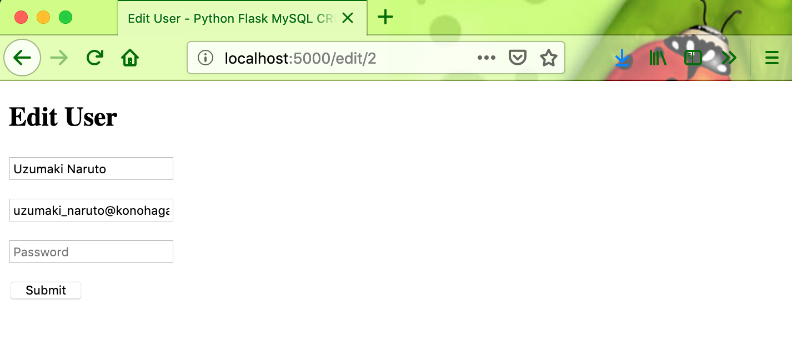
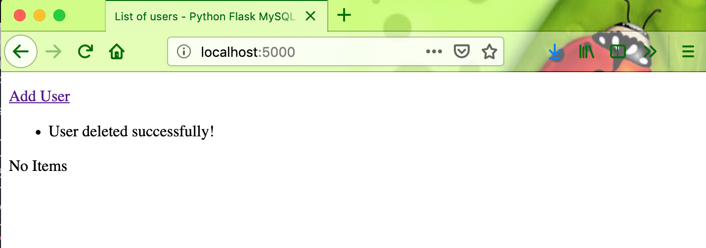

# flask-user-crud-mysql

#### Python Flask User CRUD using MySQL Database sample

#### Things to do :

1. `git clone https://github.com/hendisantika/flask-user-crud-mysql.git`
2. `cd flask-user-crud-mysql`
3. `pip install -r requirements.txt`

#### Screen shot

Add New User

List all users

Edit User

Delete user 

